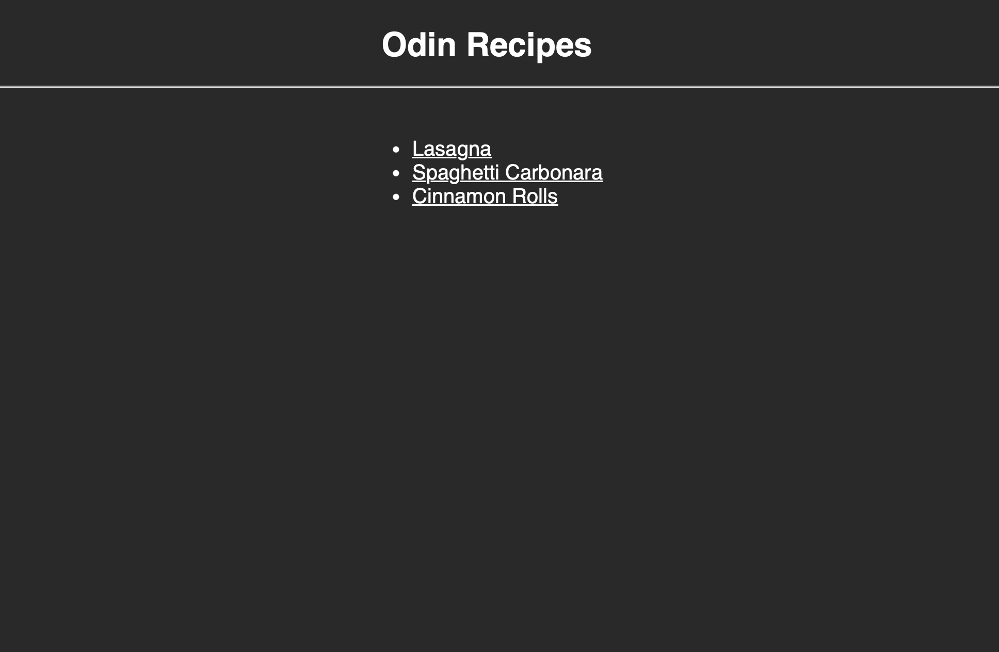
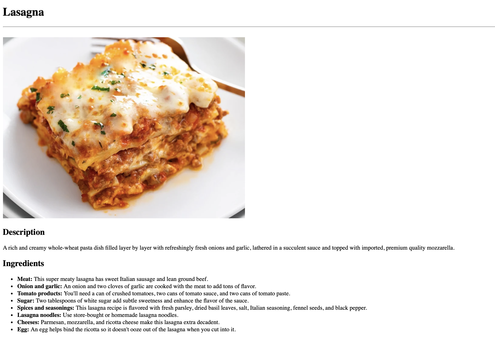

# Recipes

This was recipes, the [*first project*](https://www.theodinproject.com/lessons/foundations-recipes) within the Odin Project curriculum. This was an assignment designed to make students practice the basics of HTML and CSS knowledge acquired.

In this recipes project, I incorporated basic CSS styling and utilised the foundations of HTML to create linked pages.

## Links

- [*Live Preview*](https://devvivan.github.io/odin-recipes/)
- [*My Progress*](https://github.com/DevVivan/odin-project)

## Images

